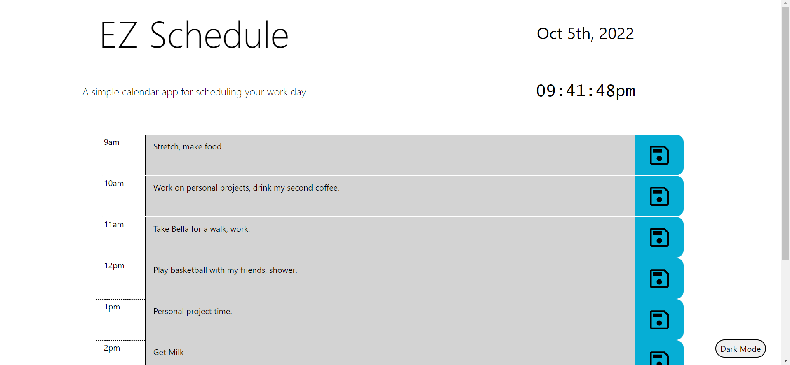
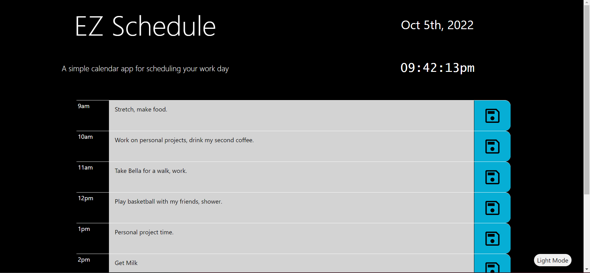

# EZ Schedule
[EZ Schedule](https://joerdixon.github.io/ez-schedule/) is a scheduling app made for people to organize their day.

## Description

EZ Schedule allows users to organize their day to day affairs with real time feedback and customizable interface.

Users will be able to write and save schedule items for reference later as well as see the current time.

Work in progress.

## Examples

Here is EZ Schedule with the light theme.

Here is EZ Schedule with the dark theme.

## Instalation

No package required, site hosted [here](https://joerdixon.github.io/ez-schedule/)

## License

N/A

